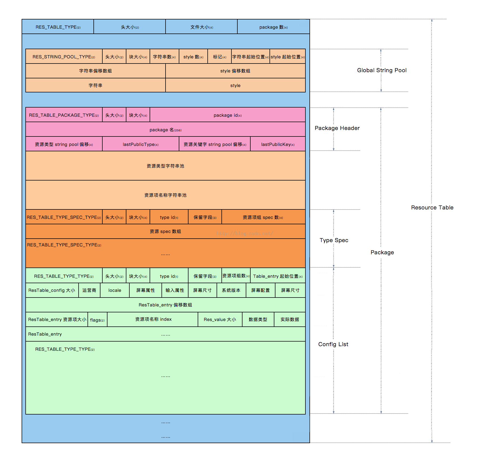

# Decoder

> research for .class, oat, elf & oat format file for compiler.

## Usage

 - [x] papk: unpack apk
 - [ ] poat: unpack oat
 - [ ] pelf: unpack elf
 - [ ] pdex: unpack dex
 - [ ] pclass: unpack class

```
decoder --papk _fixtures/apk/app-release-unsigned.apk
```

related project: [Androguard](https://github.com/androguard/androguard)

Androguard is a full python tool to play with Android files.

 - DEX, ODEX
 - APK
 - Android's binary xml
 - Android resources
 - Disassemble DEX/ODEX bytecodes
 - Decompiler for DEX/ODEX files

## Library

[Apktool](https://github.com/iBotPeaches/Apktool) is  A tool for reverse engineering Android apk files.

### Dalvik

Documents:

 - [Creating a Dalvik parser in Rust](https://superanalyzer.rocks/2016/10/18/dalvik-parser-1)
 - [Reverse engineering and penetration testing on Android apps: my own list of tools](https://www.andreafortuna.org/2019/07/18/reverse-engineering-and-penetration-testing-on-android-apps-my-own-list-of-tools/)

Library:

 - [https://github.com/mdeg/dexparser](https://github.com/mdeg/dexparser) A Rust library for parsing Android's DEX file format with parser combinators.
 - [https://github.com/letmutx/dex-parser](https://github.com/letmutx/dex-parser)  Rust parser for Android's dex format. 
 - [https://github.com/SUPERAndroidAnalyzer/dalvik](https://github.com/SUPERAndroidAnalyzer/dalvik)  Dalvik parser in pure Rust. 

Converter
 
  - [SmaliEx](https://github.com/testwhat/SmaliEx)  A wrapper to get de-optimized dex from odex/oat/vdex.
  - [dex2jar](https://github.com/pxb1988/dex2jar)  Tools to work with android .dex and java .class files.
  - [GJoy Dex Analysizer](https://github.com/charles2gan/GDA-android-reversing-Tool) GDA is a new decompiler written entirely in c++, so it does not rely on the Java platform, which is succinct, portable and fast, and supports APK, DEX, ODEX, oat.

### ELF

 - [Falcon](https://github.com/falconre/falcon)  is a formal binary analysis framework in Rust.
 - [panopticon](https://gitlab.com/p8n/panopticon) A libre program analysis library for machine code.
 - [libgoblin](https://github.com/m4b/goblin) An impish, cross-platform binary parsing crate, written in Rust.
 - [https://github.com/aep/elfkit](https://github.com/aep/elfkit) An elf read and manipulation library in pure Rust (written from scratch, no bfd, no gnu code, no license infections), intended to be used in binary manipulation utils such as strip, chrpath, objcopy and ld. The end goal is to build a well designed library that facilitates all sorts of binary manipulation magic.

### Core

[panopticon](https://gitlab.com/p8n/panopticon) is a libre program analysis library for machine code.

 - Disassemble AMD64/x86, AVR, MOS 6502 and MIPS (WIP).
 - Open PE and ELF files.
 - Translate code to RREIL, a reverse engineering focused intermediate language in Single Static Assignment form (including memory operations).
 - Construct control flow graphs and compute liveness information for each basic block.
 - Interpolate stack pointer values using Guilfanov's method.
 - Compute function summaries and substitute call sites with them.
 - Run Abstract Interpretation analysis with fixed cardinality sets, strided intervals and Value Sets.
 - Propagate constants, recover local variables and resolve indirect jumps.

[Falcon](https://github.com/falconre/falcon) is a formal binary analysis framework in Rust.

 - Expression-based IL with strong influences from RREIL and Binary Ninja's LLIL.
 - Semantically-equivalent binary translators for 32/64-bit x86, Mips, and Mipsel.
 - Lifters for ELF and PE via goblin.
 - Fixed-point engine for data-flow analysis and abstract interpretation.
 - Performant memory models for analysis.
 - A concrete executor over Falcon IL.

### Proguard

 - [Rust Proguard Parser](https://github.com/getsentry/rust-proguard)

### APK

 - [https://github.com/avast/apkparser](https://github.com/avast/apkparser) is a  APK manifest & resources parsing in Golang.

### Resources

 - [https://github.com/imager-io/imager](https://github.com/imager-io/imager)  Automated image compression for efficiently distributing images on the web.
 - [https://github.com/LiweiGogoing/resourcesParse](https://github.com/LiweiGogoing/resourcesParse)

#### Documents 
 
 - [Android 手把手分析resources.arsc](https://juejin.im/post/5d4e60c15188255d2a78b86d)



### Class

 - [smali/baksmali](https://github.com/JesusFreke/smali) is an assembler/disassembler for the dex format used by dalvik, Android's Java VM implementation. 
 - [https://github.com/ollide/intellij-java2smali](https://github.com/ollide/intellij-java2smali) Simple plugin for IntelliJ IDEA & Android Studio to easily compile Java & Kotlin files to smali.

## Documents

 - linux -> [Smallest x86 ELF Hello World](http://timelessname.com/elfbin/)
 - [ELF Hello World Tutorial](https://cirosantilli.com/elf-hello-world)

Video:

 - [The Teensy ELF Executable](https://www.muppetlabs.com/~breadbox/software/tiny/techtalk.html)

### Videos Tools 

`script`, `scriptreplay`, `recordmydesktop`, `audacity`, `pitivi`, and `ffmpeg`. 

## Specification

 - [Dalvik Executable format](https://source.android.com/devices/tech/dalvik/dex-format)

## Logs

```
apktool d _fixtures/apk/app-release-unsigned.apk

I: Using Apktool 2.4.1 on app-release-unsigned.apk
I: Loading resource table...
I: Decoding AndroidManifest.xml with resources...
I: Loading resource table from file: /Users/fdhuang/Library/apktool/framework/1.apk
I: Regular manifest package...
I: Decoding file-resources...
I: Decoding values */* XMLs...
I: Baksmaling classes.dex...
I: Copying assets and libs...
I: Copying unknown files...
I: Copying original files...
```

### Dex

| 名称 | 格式 | 说明 |
| --- | --- | --- |
| header | header_item | 标头 |
| string_ids | string_id_item[] | 字符串标识符列表。这些是此文件使用的所有字符串的标识符，用于内部命名（例如类型描述符）或用作代码引用的常量对象。此列表必须使用 UTF-16 代码点值按字符串内容进行排序（不采用语言区域敏感方式），且不得包含任何重复条目。 |
| type_ids | type_id_item[] | 类型标识符列表。这些是此文件引用的所有类型（类、数组或原始类型）的标识符（无论文件中是否已定义）。此列表必须按 `string_id` 索引进行排序，且不得包含任何重复条目。 |
| proto_ids | proto_id_item[] | 方法原型标识符列表。这些是此文件引用的所有原型的标识符。此列表必须按返回类型（按 `type_id` 索引排序）主要顺序进行排序，然后按参数列表（按 `type_id` 索引排序的各个参数，采用字典排序方法）进行排序。该列表不得包含任何重复条目。 |
| field_ids | field_id_item[] | 字段标识符列表。这些是此文件引用的所有字段的标识符（无论文件中是否已定义）。此列表必须进行排序，其中定义类型（按 `type_id` 索引排序）是主要顺序，字段名称（按 `string_id` 索引排序）是中间顺序，而类型（按 `type_id` 索引排序）是次要顺序。该列表不得包含任何重复条目。 |
| method_ids | method_id_item[] | 方法标识符列表。这些是此文件引用的所有方法的标识符（无论文件中是否已定义）。此列表必须进行排序，其中定义类型（按 `type_id` 索引排序）是主要顺序，方法名称（按 `string_id` 索引排序）是中间顺序，而方法原型（按 `proto_id` 索引排序）是次要顺序。该列表不得包含任何重复条目。 |
| class_defs | class_def_item[] | 类定义列表。这些类必须进行排序，以便所指定类的超类和已实现的接口比引用类更早出现在该列表中。此外，对于在该列表中多次出现的同名类，其定义是无效的。 |
| call_site_ids | call_site_id_item[] | 调用站点标识符列表。这些是此文件引用的所有调用站点的标识符（无论文件中是否已定义）。此列表必须按 `call_site_off` 以升序进行排序。 |
| method_handles | method_handle_item[] | 方法句柄列表。此文件引用的所有方法句柄的列表（无论文件中是否已定义）。此列表未进行排序，而且可能包含将在逻辑上对应于不同方法句柄实例的重复项。 |
| data | ubyte[] | 数据区，包含上面所列表格的所有支持数据。不同的项有不同的对齐要求；如有必要，则在每个项之前插入填充字节，以实现所需的对齐效果。 |
| link_data | ubyte[] | 静态链接文件中使用的数据。本文档尚未指定本区段中数据的格式。此区段在未链接文件中为空，而运行时实现可能会在适当的情况下使用这些数据。 |

License
---

PR8 based on [https://r8.googlesource.com/r8](https://r8.googlesource.com/r8) with Apache 2.0 see in directory.

[](http://ideas.phodal.com/)

@ 2020 A [Phodal Huang](https://www.phodal.com)'s [Idea](http://github.com/phodal/ideas).  This code is distributed under the MPL license. See `LICENSE` in this directory.
